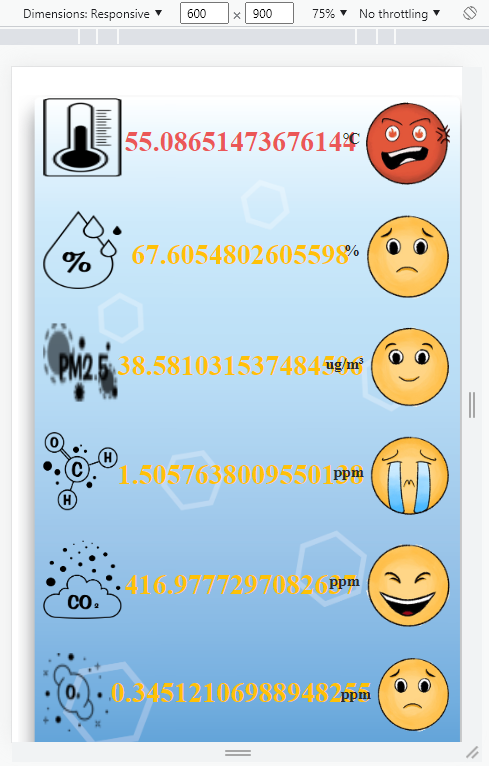

# 迅杰智能 - Dashboard 面試實作

## 測試方法
- 還原測試環境
    ```
    npm install
    ```

- 執行偽後端  (此版本的前端未寫成 webpack 打包的形式)
    ```
    npm start
    ```

- 出現 `Starting Proxy at http://localhost:3000/static/index.html` 表示後端已啟動

